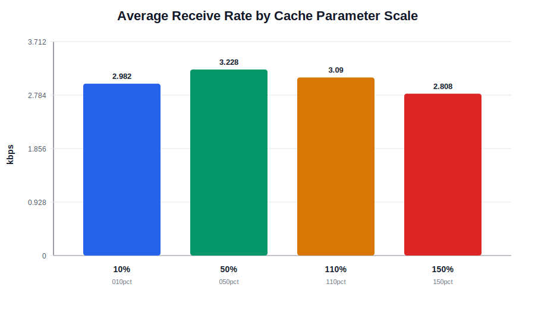
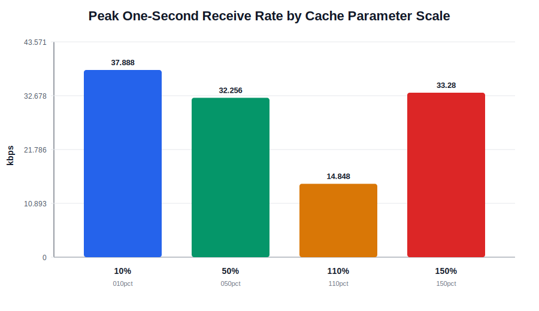
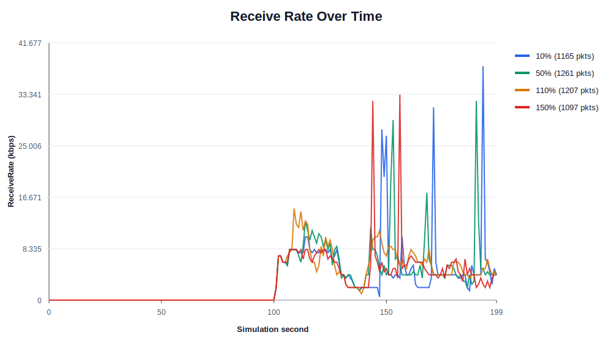
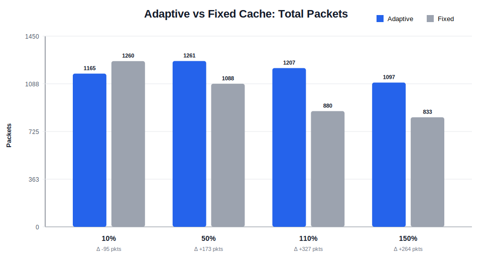
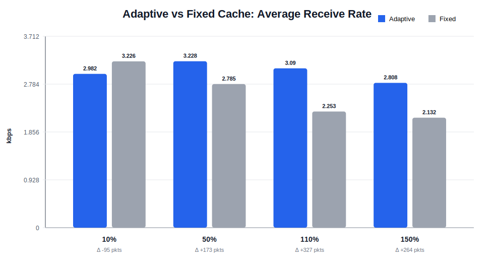

# Adaptive DSR Route Cache Parameter Sweep Report

## Introduction

This project studies Dynamic Source Routing (DSR) behavior in ns-3 MANET simulations. DSR relies on cached route and link information to avoid repeated route discovery, but that cache can become harmful when nodes move quickly. A route that was valid a few seconds ago may now point through a broken link, causing packets to be lost before DSR discovers a better route.

The new adaptive DSR experiment keeps the standard ns-3 `manet-routing-compare` topology and metrics, but changes the cache lifetime assumptions. The central idea is simple: when mobility is high, DSR should trust cached state for less time. The experiment applies this by scaling `RouteCacheTimeout`, `InitStability`, and `UseExtends` from node speed.

## Experiment Design

The sweep tested four parameter scales relative to the original DSR cache values:

- 10% of original parameters
- 50% of original parameters
- 110% of original parameters
- 150% of original parameters

Original parameter bases:

| Parameter | Original Value |
|---|---:|
| RouteCacheTimeout | 300 s |
| InitStability | 25 s |
| UseExtends | 120 s |

The adaptive formula used by the simulation is:

```text
adaptive_value = clamp(base_value * cache_reference_speed / node_speed,
                       min_value,
                       max_value)
```

The formula variables are:

| Variable | Meaning | Value Used In This Sweep |
|---|---|---:|
| `adaptive_value` | Final timer value passed into ns-3 DSR for the current run. This is the value DSR actually uses. | Depends on the run and parameter |
| `base_value` | The starting cache timer before mobility scaling. In the sweep, this is the original DSR value multiplied by 10%, 50%, 110%, or 150%. | Varies by run |
| `cache_reference_speed` | The mobility speed where the base value should be preserved. If `node_speed` equals this value, the multiplier is `1.0`. | 5 m/s |
| `node_speed` | Scenario mobility speed used to scale cache trust. Higher speed means cached routes are assumed to become stale faster. | 20 m/s |
| `min_value` | Lower safety bound. This prevents the adaptive value from becoming too aggressive or unrealistically small. | Parameter-specific |
| `max_value` | Upper safety bound. This prevents the adaptive value from becoming too long-lived. | Parameter-specific |
| `clamp(...)` | Bounds the scaled value so it stays between `min_value` and `max_value`. | n/a |

For these runs, `cache_reference_speed=5 m/s` and `node_speed=20 m/s`, so:

```text
mobility_scale = cache_reference_speed / node_speed
               = 5 / 20
               = 0.25
```

That means the adaptive experiment initially tries to use 25% of each run's base value. The final value may still be raised or lowered by `clamp` if it falls outside the configured bounds.

The bounds used by this experiment are:

| Parameter | `min_value` | `max_value` | Why It Matters |
|---|---:|---:|---|
| `RouteCacheTimeout` | 30 s | 300 s | Controls how long cached routes can remain usable before expiring. |
| `InitStability` | 2 s | 25 s | Controls the initial expected stability assigned to a newly learned link in LinkCache. |
| `UseExtends` | 10 s | 120 s | Controls how much successful link use extends confidence in that link. |

Example for the 50% run:

```text
base RouteCacheTimeout = 300 s * 0.50 = 150 s
adaptive RouteCacheTimeout = clamp(150 * 0.25, 30, 300)
                           = clamp(37.5, 30, 300)
                           = 37.5 s

base InitStability = 25 s * 0.50 = 12.5 s
adaptive InitStability = clamp(12.5 * 0.25, 2, 25)
                       = 3.125 s

base UseExtends = 120 s * 0.50 = 60 s
adaptive UseExtends = clamp(60 * 0.25, 10, 120)
                    = 15 s
```

This is why the 50% adaptive run does not use the fixed 50% values directly. It first scales the original DSR values to 50%, then applies the mobility-aware `0.25` multiplier.

## Implementation Summary

The adaptive experiment was implemented in `ns-3.46.1/examples/routing/manet-routing-compare-adaptive-cache.cc`. It started as a copy of ns-3's `manet-routing-compare` example, then was modified to expose DSR cache controls, compute mobility-scaled values, apply those values before DSR is installed, and store run outputs in project-local folders.

### Command-Line Controls

The experiment adds command-line arguments so cache behavior can be changed without recompiling:

```cpp
cmd.AddValue("adaptiveRouteCache",
             "Enable adaptive DSR route cache timeout",
             m_adaptiveRouteCache);
cmd.AddValue("adaptiveLinkStability",
             "Enable adaptive DSR LinkCache InitStability and UseExtends",
             m_adaptiveLinkStability);
cmd.AddValue("cacheType", "DSR route cache type (PathCache or LinkCache)", m_cacheType);
cmd.AddValue("baseRouteCacheTimeout",
             "Base DSR route cache timeout in seconds",
             m_baseRouteCacheTimeout);
cmd.AddValue("baseInitStability",
             "Base DSR LinkCache InitStability in seconds",
             m_baseInitStability);
cmd.AddValue("baseUseExtends", "Base DSR LinkCache UseExtends in seconds", m_baseUseExtends);
cmd.AddValue("cacheReferenceSpeed",
             "Mobility speed in m/s where the base cache timeout is used",
             m_cacheReferenceSpeed);
```

The key point is that the same executable can run either adaptive-cache DSR or fixed-cache DSR. The fixed-cache comparison runs used:

```text
adaptiveRouteCache=false
adaptiveLinkStability=false
```

### Adaptive Timer Calculation

The adaptive logic is applied only for DSR. The simulation computes a mobility scale from the reference speed and scenario node speed:

```cpp
const double speed = std::max(1.0, static_cast<double>(nodeSpeed));
const double mobilityScale = m_cacheReferenceSpeed / speed;
```

Then `RouteCacheTimeout` is shortened or lengthened from the chosen base value:

```cpp
m_effectiveRouteCacheTimeout = m_baseRouteCacheTimeout;
if (m_adaptiveRouteCache)
{
    const double scaledTimeout = m_baseRouteCacheTimeout * mobilityScale;
    m_effectiveRouteCacheTimeout =
        std::clamp(scaledTimeout, m_minRouteCacheTimeout, m_maxRouteCacheTimeout);
}
```

The LinkCache stability values are adapted the same way:

```cpp
m_effectiveInitStability = m_baseInitStability;
m_effectiveUseExtends = m_baseUseExtends;
if (m_adaptiveLinkStability)
{
    m_effectiveInitStability =
        std::clamp(m_baseInitStability * mobilityScale,
                   m_minInitStability,
                   m_maxInitStability);
    m_effectiveUseExtends =
        std::clamp(m_baseUseExtends * mobilityScale, m_minUseExtends, m_maxUseExtends);
}
```

The `clamp` bounds matter. They prevent aggressive sweep values from becoming unrealistically small and prevent large sweep values from growing without limit.

### Applying The Values To DSR

The computed values are applied with `Config::SetDefault` before the DSR helper installs routing on the nodes:

```cpp
Config::SetDefault("ns3::dsr::DsrRouting::CacheType", StringValue(m_cacheType));
Config::SetDefault("ns3::dsr::DsrRouting::RouteCacheTimeout",
                   TimeValue(Seconds(m_effectiveRouteCacheTimeout)));
Config::SetDefault("ns3::dsr::DsrRouting::InitStability",
                   TimeValue(Seconds(m_effectiveInitStability)));
Config::SetDefault("ns3::dsr::DsrRouting::UseExtends",
                   TimeValue(Seconds(m_effectiveUseExtends)));
```

This placement is important. If the values are set after `dsrMain.Install(dsr, adhocNodes)`, the DSR objects may already have been created with their old defaults. Setting them first ensures the experiment actually changes the DSR route-cache behavior.

### Metrics Collection

Packet reception is counted in `ReceivePacket()`:

```cpp
bytesTotal += packet->GetSize();
packetsReceived += 1;
```

Then `CheckThroughput()` writes one CSV row per simulated second:

```cpp
double kbs = (bytesTotal * 8.0) / 1000;

out << (Simulator::Now()).GetSeconds() << "," << kbs << "," << packetsReceived << ","
    << m_nSinks << "," << m_protocolName << "," << m_txp << "" << std::endl;
```

This preserves the original `manet-routing-compare` style metrics while letting the cache policy change.

### Output Folder Modification

The experiment was also modified to store metrics under the project directory instead of `/tmp`:

```cpp
std::string m_outputDirectory{
    "/Users/fmolinar/Documents/school/csci256-wireless-spring26/ns3-dsr/simulation-results/"
    "adaptive-cache"};
std::string m_runLabel{"linkcache-tuned"};
```

When no exact `CSVfileName` is provided, it creates a timestamped folder:

```cpp
m_runDirectory = (fs::path(m_outputDirectory) / (m_runLabel + "-" + MakeTimestamp())).string();
fs::create_directories(m_runDirectory);
m_CSVfileName = (fs::path(m_runDirectory) / "metrics.csv").string();
```

This made the parameter sweep manageable because each run can keep its own `metrics.csv`, `run.log`, and README without overwriting previous results.

## Simulation Scenario

The scenario remains aligned with ns-3's default MANET routing comparison example:

| Setting | Value |
|---|---:|
| Nodes | 50 |
| Area | 300 m x 1500 m |
| Mobility | RandomWaypointMobilityModel |
| Speed | 0-20 m/s |
| Pause | 0 s |
| Simulation time | 200 s |
| Traffic start | Random between 100 and 101 s |
| Traffic pairs | 10 one-to-one UDP source/sink pairs |
| Packet size | 64 bytes |
| Application rate | 2048 bps |
| WiFi mode | 802.11b, DsssRate11Mbps |
| Propagation | FriisPropagationLossModel |
| Tx power | 7.5 dBm |

## Results

| Run | Base Timeout | Effective Timeout | Effective InitStability | Effective UseExtends | Total Packets | Avg kbps | Peak kbps |
|---|---:|---:|---:|---:|---:|---:|---:|
| 10% | 30 s | 30 s | 2 s | 10 s | 1165 | 2.982 | 37.888 |
| 50% | 150 s | 37.5 s | 3.125 s | 15 s | 1261 | 3.228 | 32.256 |
| 110% | 330 s | 82.5 s | 6.875 s | 33 s | 1207 | 3.09 | 14.848 |
| 150% | 450 s | 112.5 s | 9.375 s | 45 s | 1097 | 2.808 | 33.28 |

The best run in this sweep was **50%**, with **1261 packets received** and an average receive rate of **3.228 kbps** over the full 200-second simulation.








## Interpretation

The 50% setting produced the strongest packet delivery in this sweep. That suggests that the original cache assumptions may still be too optimistic for this high-mobility scenario, but cutting them too aggressively can also leave performance on the table.

The 10% run still performed well, but its effective values were clamped to minimums for all three tuned parameters. This means it represents the lower bound behavior more than a pure 10% scaling result.

The 110% and 150% runs were weaker than 50%. This supports the route-staleness hypothesis: longer cache/link stability assumptions allow DSR to reuse stale state more often under mobility, which can reduce delivery.

## Fixed-Cache Comparison

After the initial adaptive-only sweep, a second set of runs was added to compare against fixed-cache DSR behavior using the same parameter percentages. These comparator runs use the same topology, traffic, and metrics, but set:

```text
adaptiveRouteCache=false
adaptiveLinkStability=false
```

So, for example, the 50% fixed run uses `RouteCacheTimeout=150s`, `InitStability=12.5s`, and `UseExtends=60s` directly. The matching 50% adaptive run scales those values by mobility and uses `RouteCacheTimeout=37.5s`, `InitStability=3.125s`, and `UseExtends=15s`.

| Run | Adaptive Effective Timeout | Fixed Timeout | Adaptive Packets | Fixed Packets | Adaptive Delta | Adaptive Avg kbps | Fixed Avg kbps |
|---|---:|---:|---:|---:|---:|---:|---:|
| 10% | 30 s | 30 s | 1165 | 1260 | -95 (-7.54%) | 2.982 | 3.226 |
| 50% | 37.5 s | 150 s | 1261 | 1088 | +173 (15.901%) | 3.228 | 2.785 |
| 110% | 82.5 s | 330 s | 1207 | 880 | +327 (37.159%) | 3.09 | 2.253 |
| 150% | 112.5 s | 450 s | 1097 | 833 | +264 (31.693%) | 2.808 | 2.132 |





The fixed comparison shows that adaptive tuning helped at 50%, 110%, and 150%, but not at 10%. The 10% adaptive run hits the configured minimums, while the fixed 10% run uses an even smaller `InitStability` base than the adaptive minimum would allow. That makes the 10% point useful, but also a reminder that clamps shape the low end of the experiment.

## Notes

- Each CSV has 200 data rows, one per simulated second, plus a header row.
- `ReceiveRate` is measured in kilobits received during that one-second interval.
- `PacketsReceived` is the packet count received during that interval.
- These runs used `LinkCache`, matching the default adaptive experiment configuration.
- The simulation is deterministic for this setup because the example assigns streams for mobility; still, future work should repeat runs across seeds before making strong claims.

## Future Work

- Add repeated trials with different random seeds to measure variance.
- Sweep `cacheReferenceSpeed` separately from the cache parameter bases.
- Compare `LinkCache` against `PathCache` across the same percentage settings.
- Add node speed as a command-line option and sweep low, medium, and high mobility scenarios.
- Add node density sweeps, such as 25, 50, 75, and 100 nodes.
- Track routing overhead if we want to measure the tradeoff between better delivery and extra route discovery.
- Consider writing a helper script that runs all sweeps automatically and emits this report after each batch.
